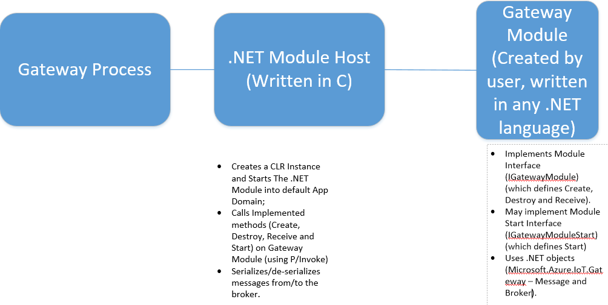

Building Azure IoT Gateway Modules in .NET
=============================================

Overview
--------

This document describes the high level design of the .NET binding mechanism used by Azure IoT Gateway SDK. 
It describes how the .NET CLR is hosted in the gateway process's memory and how the interaction between the
native and .NET Managed Modules will work.

Design
------

.NET Module Host
----------------
The **.NET Module Host** is a C module that

1. Creates a .NET CLR instance at the first time a .NET module is loaded;

2. Brokers calls **to** the .NET Module (create, destroy, receive).

3. Brokers calls **from** the .NET Module (Message_Create, MessageBus_Publish);

###JSON Configuration

The JSON configuration for .NET Module will be similar to the configuration for Node and Java Module Host:

~~~~~~~~~~~~~~~~~~~~~~~~~~~~~~~~~~~~~~~~~~~~~~~~~~~~~~~~~~~~~~~~~~~~~~~~~~~ JSON
{
    "modules": [
        {
            "module name": "csharp_hello_world",
            "module path": "/path/to/dotnet_module_host.dll",
            "args": {
                "dotnet_module_path": "/path/to/csharp_module.dll",
                "dotnet_entry_class": "mycsharpmodule.classname",
                "args": "module configuration"
            }
        }
    ]
}
~~~~~~~~~~~~~~~~~~~~~~~~~~~~~~~~~~~~~~~~~~~~~~~~~~~~~~~~~~~~~~~~~~~~~~~~~~~

1. `module name` is the name of the module created (.NET Module) that will be stored by the gateway and used internally;

2. `module path` is the path where the dotnet_module_host.dll (native module) is located and will be used to interface between gateway and .NET Module;

3. `args` is the configuration specifically for the .NET Module. 

    3.1 `dotnet_module_path`: place where the .NET module is located;
    3.2 `dotnet_entry_class`: class that implements `IGatewayModule`; 
    3.3 `args`: The value of this property is used to supply configuration information specific to a given .NET module. The value is serialized as a string and passed verbatim to the .NET module;  

##Native methods description
### Module\_Create

When the **.NET Module Host**’s `Module_Create` function is invoked by the
gateway process, it:

-   Creates a CLR instance (if not created yet); 

-   Loads the .NET module from the path indicated on the configuration (dotnet_module_path) into Default App domain, by calling `ExecuteInDefaultAppDomain`, invokes default constructor at the class (dotnet_entry_class) and calls `Create` method, implemented by the `IGatewayModule` interface;

### Module\_Receive

When the **.NET Module Host**’s `Module_Receive` function is invoked by the
gateway process, it:

-   Serializes (by calling `Message_ToByteArray` the message content and properties and invokes the `Receive` method implemented by the .NET module (`IGatewayInterface` below). The .NET module will deserialize this byte_array into a Message object.

### Module\_Destroy

When the **.NET Module Host**’s `Module_Destroy` function is invoked by the
gateway, it:

-   Releases resources allocated and calls the `Destroy` method implemented by the .NET Module.

.NET Wrappers and objects
-------------------------

This is going to be a layer written in .NET that will wrap our native C interface. 
For .NET Modules the following wrappers will be provided:
1. `Message` - Object that represents a message;

2. `MessageBus` - Object that represents the bus, which will be used to publish messages on to the bus;

3. `IGatewayModule` - interface that has to be implemented by the .NET Module; 

The high level design of these objects and interfaces is documented below:

### Message
~~~~~~~~~~~~~~~~~~~~~~~~~~~~~~~~~~~~~~~~~~~~~~~~~~~~~~~~~~~~~~~~~~~~~~~~~~ C#
    
    namespace Microsoft.Azure.IoT.Gateway
    {
        /// 
 Object that represents a message on the message bus. 

        public class Message
        {
            public Buffer Content { set; get; };
            
            public Dictionary<string,string> Properties  { set; get; };

            public Message();
            
            public Message(Buffer content, Dictionary<string, string> properties); 
            
            public Message(Message message);
        }        
    }
~~~~~~~~~~~~~~~~~~~~~~~~~~~~~~~~~~~~~~~~~~~~~~~~~~~~~~~~~~~~~~~~~~~~~~~~~~

### MessageBus
~~~~~~~~~~~~~~~~~~~~~~~~~~~~~~~~~~~~~~~~~~~~~~~~~~~~~~~~~~~~~~~~~~~~~~~~~~ C#
    
    namespace Microsoft.Azure.IoT.Gateway
    {
        /// 
 Object that represents the bus, to where a messsage is going to be published 

        public class MessageBus
        {
            /// 

            ///     Publish a message into the gateway message bus. 
            /// 

            /// <param name="message">Object representing the message to be published into the bus.</param>
            /// <returns></returns>
            public void Publish(Message message);
        }        
    }
~~~~~~~~~~~~~~~~~~~~~~~~~~~~~~~~~~~~~~~~~~~~~~~~~~~~~~~~~~~~~~~~~~~~~~~~~~

### IGatewayModule
~~~~~~~~~~~~~~~~~~~~~~~~~~~~~~~~~~~~~~~~~~~~~~~~~~~~~~~~~~~~~~~~~~~~~~~~~~ C#
    
    /// 
 Interface to be implemented by the .NET Module 

    public interface IGatewayModule
    {
            /// 

            ///     Creates a module using the specified configuration connecting to the specified message bus.
            /// 

            /// <param name="bus">The bus onto which this module will connect.</param>
            /// <param name="configuration">A string with user-defined configuration for this module.</param>
            /// <returns></returns>
            void Create(MessageBus bus, string configuration);
            
            /// 

            ///     Disposes of the resources allocated by/for this module.
            /// 

            /// <param name="moduleHandle">The #MODULE_HANDLE of the module to be destroyed.</param>
            /// <returns></returns>
            void   Destroy();

            /// 

            ///     The module's callback function that is called upon message receipt.
            /// 

            /// <param name="received_message">The message being sent to the module.</param>
            /// <returns></returns>                
            void Receive(Message received_message);                
    }
~~~~~~~~~~~~~~~~~~~~~~~~~~~~~~~~~~~~~~~~~~~~~~~~~~~~~~~~~~~~~~~~~~~~~~~~~~

Flow Diagram
------------

Following is the flow diagram of a lifecycle of the .NET module: 
