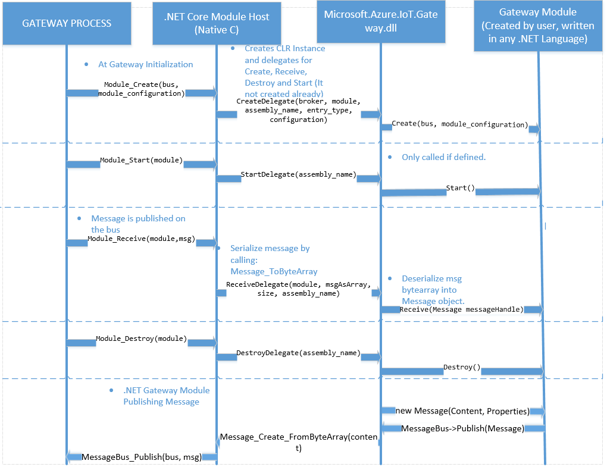

DotNet Sample for Windows Desktop
=================================

Overview
--------

This sample showcase how one might build modules for IoT Gateway in .NET.

The sample contains:

1. A printer module (C#) that interprets telemetry from sensor and IoT Hub HTTP module and prints it's content and properties into Console;
2. A sensor module (C#) that publishes random data to the gateway;
3. A logger module for producing message bus diagnostics;
4. An IoT Hub HTTP module for uploading telemetry from the sensor Azure IoT Hub;

Other resources:
*[getting started doc](getting_started.md)
*[devbox setup](devbox_setup.md)
*[Dotnet binding High Level Design](../bindings/dotnet/devdoc/dotnet_bindings_hld.md)
*.Net Framework Installer: https://www.microsoft.com/en-us/download/details.aspx?id=17851

Prerequisites
--------------
1. Have you devbox setup (windows) [devbox setup](devbox_setup.md);
2. Make sure you have .NET Framework installed. Our current version of the binding was tested and loads modules written in .NET version v4.0.30319;

How does the data flow through the Gateway
------------------------------------------
You can find the diagram for Receiving a message and publishing a message on this flow chart:




Building the sample
-------------------
At this point, gateways containing .NET modules are only supported on Windows Desktop. Gateway gets built when you build the SDK by running `tools/build.cmd`.  The
[devbox setup](devbox_setup.md) guide has information on how you can build the SDK.
To build .NET Modules you should build solution here (../bindings/dotnet/dotnet-binding/dotnet-binding.sln).
Today the Solution has: 
1. Microsoft.Azure.IoT.Gateway ==> DLL you shall reference on your module project;
2. Microsoft.Azure.IoT.Gateway.Test ==> Unit tests for the implementation of Message and MessageBus Classes;
3. PrinterModule ==> .NET(C#) Module that output to the console content received by Sensor Module;
4. Sensor Module ==> .NET(C#) Module that publishes Simulated Sensor data to the gateway;

Building the solution you will have the following binaries: 
1. Microsoft.Azure.IoT.Gateway.Test.dll
2. SensorModule.dll
3. PrinterModule.dll

Copy these binaries to the same folder you run your gateway. 

Running the sample
------------------
1. Open azure_iot_gateway_sdk solution and configure project `dotnet_binding_sample` as a Startup Sample;
2. Go to the Project Properties and change `Command Arguments` to point to dotnet_binding_sample.json;
3. Copy the following binaries to the folder: `build\samples\dotnet_binding_sample\Debug`:\
    * Microsoft.Azure.IoT.Gateway.dll(and pdb if you want to debug);
    * PrinterModule.dll
    * SensorModule.dll
4. Change the configuration Debugger Type to Mixed (this way you will be able to set breakpoints on Managed code as well as Native Code);
5. Run.


Json Configuration
------------------
```json
{
    "modules" :
    [
        {
            "module name" : "logger_hl",
            "module path" : "..\\..\\..\\modules\\logger\\Debug\\logger_hl.dll",
            "args" : {"filename":"C:\\Temp\\Log.txt"} 
        },
        {
          "module name": "dotnet_sensor_module",
          "module path": "..\\..\\..\\bindings\\dotnet\\Debug\\dotnet_hl.dll",
          "args": {
            "dotnet_module_path": "SensorModule",
            "dotnet_module_entry_class": "SensorModule.DotNetSensorModule",
            "dotnet_module_args": "module configuration"
          }
        },
        {
            "module name" : "dotnet_printer_module",
            "module path" : "..\\..\\..\\bindings\\dotnet\\Debug\\dotnet_hl.dll",
            "args" : {
                "dotnet_module_path": "PrinterModule",
                "dotnet_module_entry_class": "PrinterModule.DotNetPrinterModule",
                "dotnet_module_args": "module configuration"
            }
        }

    ]
}
```
