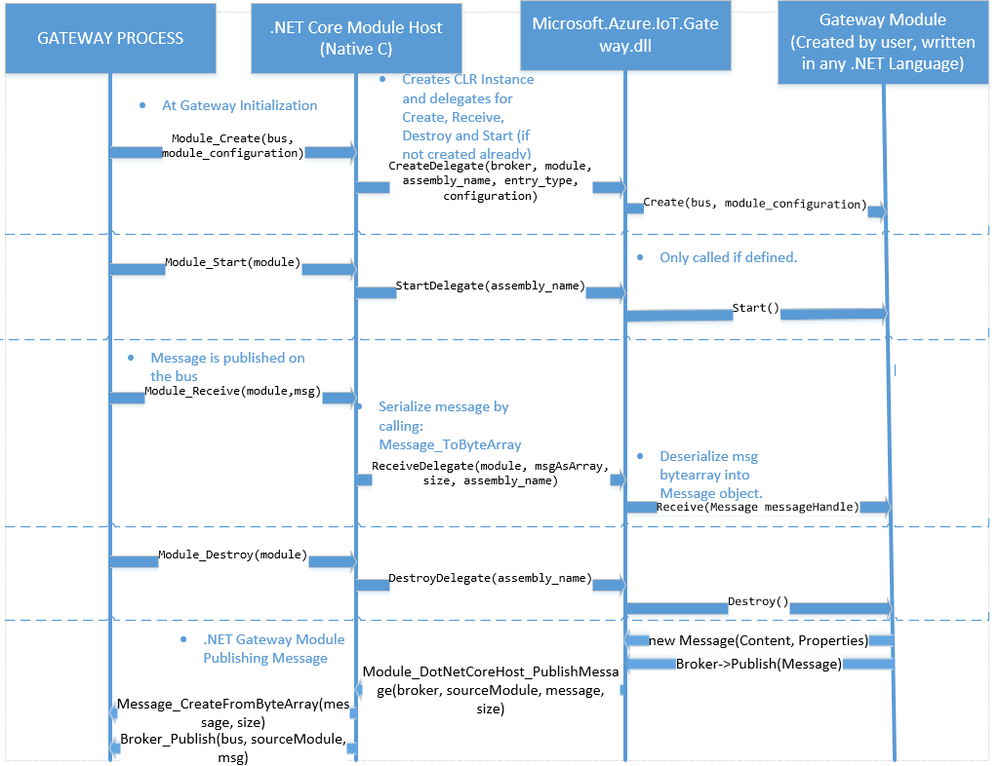

.NET Core Sample for Windows Desktop
====================================

Overview
--------

This sample showcases how one might build modules for IoT Gateway in .NET Core.

The sample contains:

1. A printer module (C#) that interprets telemetry from sensor and prints its content and properties into Console.
2. A sensor module (C#) that publishes random data to the gateway.
3. A logger module for producing message broker diagnostics.

Other resources:
- Hello World [sample](../hello_world/README.md)
- [Devbox setup](../../doc/devbox_setup.md)
- [.NET Core binding High Level Design](../../bindings/dotnetcore/devdoc/dotnet_core_binding_hld.md)
- [.Net Core Framework Installer](https://www.microsoft.com/net/download/core)

Prerequisites
--------------
1. Setup your Windows development machine. A guide for doing this can be found [here](../../doc/devbox_setup.md).
2. Make sure you have .NET Core Framework installed. Our current version of the binding was tested and loads modules written in .NET version v1.0.1.

How does the data flow through the Gateway
------------------------------------------
You can find the diagram for Receiving a message and publishing a message on this flow chart:




Building the sample
-------------------
The sample Gateway gets built when you build the SDK by first running
```
tools\build.cmd --enable-dotnet-core-binding
```

The [devbox setup](../../doc/devbox_setup.md) guide has more information on how you can build the SDK.

The `build_dotnet_core.cmd` script builds the .NET Core Modules in the solution located here (../bindings/dotnetcore/dotnet-core-binding/dotnet-core-binding.sln).
Today the Solution has: 
1. Microsoft.Azure.IoT.Gateway ==> DLL you shall reference on your module project.
2. PrinterModule ==> .NET(C#) Core Module that output to the console content received by Sensor Module.
3. Sensor Module ==> .NET(C#) Core Module that publishes Simulated Sensor data to the gateway.

Building the solution you will have the following binaries: 
1. Microsoft.Azure.IoT.Gateway.Test.dll.
2. SensorModule.dll.
3. PrinterModule.dll.

Copy these binaries to the same folder you run your gateway. 

Running the sample
------------------
1. Open azure_iot_gateway_sdk solution and configure project `dotnet_core_binding_sample` as a Startup Sample.
2. Go to the Project Properties and change `Command Arguments` to point to dotnet_core_binding_sample.json.
3. Copy the following binaries to the folder: `build\samples\dotnet_core_binding_sample\Debug`:
    * Microsoft.Azure.IoT.Gateway.dll(and pdb if you want to debug).
    * PrinterModule.dll.
    * SensorModule.dll.
4. Change the configuration Debugger Type to Mixed (this way you will be able to set breakpoints on Managed code as well as Native Code).
5. Run.


Json Configuration
------------------
```json
{
    "modules": [
        {
            "name": "logger",
            "loader": {
                "name": "native",
                "entrypoint": {
                    "module.path": "..\\..\\..\\modules\\logger\\Debug\\logger.dll"
                }
            },
            "args": { "filename": "C:\\Temp\\Log.txt" }
        },
        {
            "name": "dotnet_sensor_module",
            "loader": {
                "name": "dotnetcore",
                "entrypoint": {

                    "assembly.name": "SensorModule",
                    "entry.type": "SensorModule.DotNetSensorModule"
                }
            },
            "args": "module configuration"
        },
        {
            "name": "dotnet_printer_module",
            "loader": {
                "name": "dotnetcore",
                "entrypoint": {
                    "assembly.name": "PrinterModule",
                    "entry.type": "PrinterModule.DotNetPrinterModule"
                }
            },
            "args": "module configuration"
        }
    ],
    "links": [
      {"source": "dotnet_sensor_module", "sink": "dotnet_printer_module" }
    ]
}
```

Creating your own module
------------------------
1. Create a .NET Core project (DLL) (Class library).
2. Add Reference to Microsoft.Azure.IoT.Gateway DLL.
3. On your class you shall implement `IGatewayModule`.
   See the Printer module as example:
~~~~~~~~~~~~~~~~~~~~~~~~~~~~~~~~~~~~~~~~~~~~~~~~~~~~~~~~~~~~~~~~~~~~~~~~~~ C#
using System;
using System.Collections.Generic;
using System.Linq;
using System.Text;
using System.Threading.Tasks;
using Microsoft.Azure.IoT.Gateway;


namespace PrinterModule
{
    public class DotNetPrinterModule : IGatewayModule
    {
        private string configuration;
        public void Create(Broker broker, byte[] configuration)
        {
            this.configuration = System.Text.Encoding.UTF8.GetString(configuration);
        }

        public void Destroy()
        {
        }

        public void Receive(Message received_message)
        {
            if(received_message.Properties["source"] == "sensor")
            {
                Console.WriteLine("Printer Module received message from Sensor. Content: " + System.Text.Encoding.UTF8.GetString(received_message.Content, 0, received_message.Content.Length));
            }
        }
    }
}
~~~~~~~~~~~~~~~~~~~~~~~~~~~~~~~~~~~~~~~~~~~~~~~~~~~~~~~~~~~~~~~~~~~~~~~~~~

Modules may also implement the `IGatewayModuleStart` interface.  The Start method is called when the Gateway's Broker is ready for the module to send and receive messages. 

4. Add your new module on Json configuration:
```json
{
    "modules" :
    [
        {
            "name": "dotnet_printer_module", ==> Your new module name. 
            "loader": {
                "name": "dotnetcore",
                "entrypoint": {

                    "assembly.name": "SensorModule",==> This is the name of your module dll. On this sample it is SensorModule.dll
                    "entry.type": "SensorModule.DotNetSensorModule" ==> This is the name of your Class (Namespace.ClassName) that implements IGatewayModule.
                }
            },
            "args": "module configuration"  ==> This is any configuration you want to use on your sample. It will be passed to you as a byte[] that should be converted to an UTF-8 Encoded String, you can add a JSON configuration in it.
        }
    ]
}
```