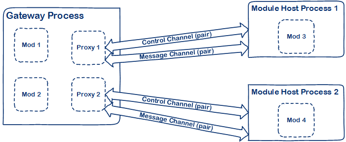

#Azure IoT Gateway SDK - out of process proxy module example

This document provides an overview of the out of process module [code](./src) which allows a module to run in a separate process.

##Concepts

Until this feature, all gateway modules were required to run in the same process as the gateway executable. Now, the user may define a module that runs in a different process on the same machine.  For details, please read the [outprocess high level design](../../core/devdoc/outprocess_hld.md).

There are two executables "proxy\_sample" and "proxy\_sample\_remote". The "proxy\_sample" is a gateway executable with an out of process module, and "proxy\_sample\_remote" is the executable which implements the out of process modules.

The two processes must establish a control channel to communicate gateway events to the module, such as module creation and deletion. In this example, the control channel name is given in the sample JSON configuration for "proxy\_sample" is provided on the command line to "proxy\_sample\_remote".  Once communication is established, the modules will sent gateway data over a messaging channel.



##How to run the sample

###Linux

The easiest way to run the sample is to start two terminal sessions, navigate to the `build/samples/proxy_sample` directory in each and run
"proxy\_sample" in one and "proxy\_sample\_remote" in the other.

Terminal 1:
```
cd <build root>
cd build/samples/proxy_sample
./proxy_sample ../../../samples/proxy_sample/src/proxy_sample_lin.json
```

Terminal 2:
```
cd <build root>
cd build/samples/proxy_sample
./proxy_sample_remote outprocess_module_control
```

###Windows

Start two command prompts, navigate to the `build\samples\proxy_sample` directory in each and run "proxy\_sample" in one and "proxy\_sample\_remote" in the other.

Command prompt 1:
```
cd <build root>
cd build\samples\proxy_sample
Debug\proxy_sample.exe ..\..\..\samples\proxy_sample\src\proxy_sample_win.json
```

Command prompt 2:
```
cd <build root>
cd build\samples\proxy_sample
Debug\proxy_sample_remote.exe outprocess_module_control
```

You may also run the executables simultaneously by opening up the solution file, opening the properties for the top level solution, select "Multiple startup projects", and choose "proxy\_sample" in one and "proxy\_sample\_remote" to start.

## Example Gateway configuration.

This sample gateway has three modules, the "Hello World" module, which periodically generates a message, the "out of process" module which configures the gateway for communication to the "proxy\_sample\_remote" process, and a "logger" module to record any messages returning from the out of process module.

```JSON
{
  "modules": [
    {
      "name": "logger",
      "loader": {
        "name": "native",
        "entrypoint": {
          "module.path": "..\\..\\..\\modules\\logger\\Debug\\logger.dll"
        }
      },
      "args": {
        "filename": "log.txt"
      }
    },
    {
      "name": "out of process",
      "loader": {
        "name": "outprocess",
        "entrypoint": {
          "activation.type": "none",
          "control.id": "outprocess_module_control"
        }
      },
      "args": "THIS IS THE OOP MODULE CONFIGURATION"
    },
    {
      "name": "hello_world",
      "loader": {
        "name": "native",
        "entrypoint": {
          "module.path": "..\\..\\..\\modules\\hello_world\\Debug\\hello_world.dll"
        }
      },
      "args": null
    }
  ],
  "links": [
    {
      "source": "hello_world",
      "sink": "out of process"
    },
    {
      "source": "out of process",
      "sink": "logger"
    }
  ]
}
```